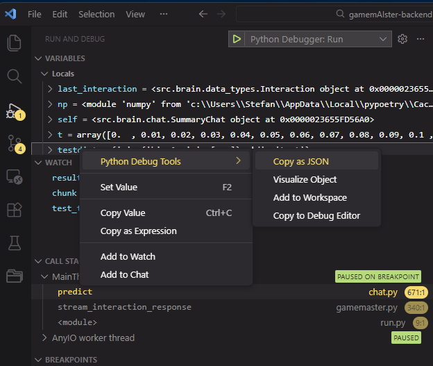
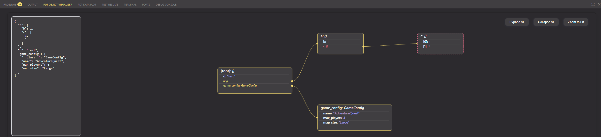
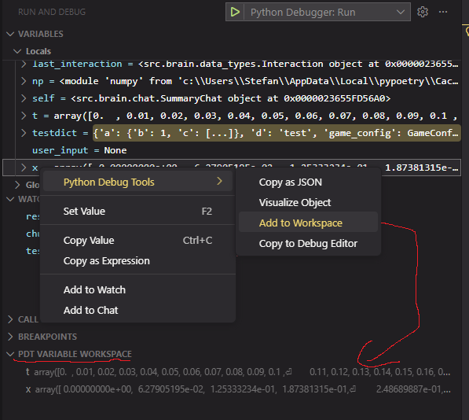
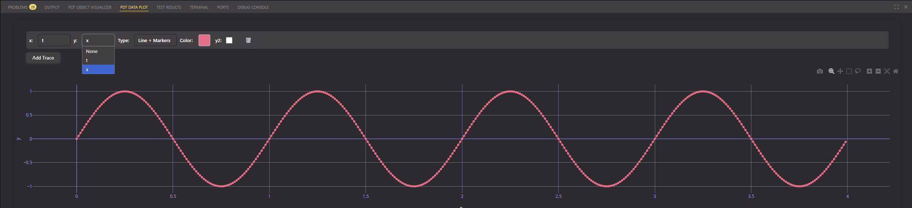

# Python Debug Tools

Python Debug Tools is a Visual Studio Code extension that provides utilities for Python debugging, making it easier to inspect and copy variables as JSON during a debug session.

## Features

- **Copy as JSON**: Right-click a variable in the debug variables view or in the editor (while debugging) and select **Copy as JSON** to copy its value as a JSON string to your clipboard.
- **PDT Object Visualizer**: Visualize variable content as tree
- **PDT Data Plot**: Visualize data (numerical lists, numpy arrays) as dynamic Scatter or Line Plot (Plotly)
- **PDT Debug Editor**: Right click on selected code to copy into PDT Debug Editor (temporary tab) where you can edit the code and use VSCode's native "Evaluate in Debug Console" to execute (lightweight PyCharm Evaluate Expression clone)
- **Context Menu Integration**: The command is available in the debug variables context menu and the editor context menu (when in debug mode).
- **Theme Support**: Styles the PDT menus according to selected VSCode theme

### Copy as JSON
1) Right click in Variable Explorer, Watch or direct inside the source code on variable to access the PDT Menu -> Copy as JSON
2) JSON of the object will be stored in Clipboard

Notes:
- Supports Python lists, tuples, sets, dictionaries, *simple* class instances and NumPy arrays (as JSON arrays or objects).
- Handles nested structures and common Python types.
  

### PDT Object Visualizer
1)  Right click in Variable Explorer, Watch or direct inside the source code on variable to access the PDT Menu -> Visualize Object
2) 3.js nested tree of the object will be visualized in *PDT Object Visualizer* tab

Notes:
- Supports Python lists, tuples, sets, dictionaries, *simple* class instances and NumPy arrays (as JSON arrays or objects).
- Handles nested structures and common Python types.

### PDT Data Plot
1) Right click in Variable Explorer to access the PDT menu -> Add to Workspace
2) This adds the variable to the *PDT Variable Workspace*
2) Go to *PDT Data Plot* tab
3) All Variables in the *PDT Variable Workspace* can be selected for plotting

### PDT Debug Editor
This is a lightweight clone of PyCharm's Evaluate Expression. It's quite hacky due to VSCode's limitations. Still, I find it a nice quality of life feature. 
You can copy a selected code snippet to a temporary *PDT Debug Editor*, change it to test its behavior and use VSCode's native "Evaluate in Debug Console"

1) Select code snippet
2) Right click on selected code snippet to access the PDT menu -> Copy to Debug Editor
3) A new temporary tab *PDT Debug Editor* opens with the code snippet
4) Adapt the code snippet and right click on selected code -> Evaluate in Debug Console

## Requirements

- Visual Studio Code 1.102.0 or later
- Python debugging must be active (requires a Python debug session)

## Extension Settings

This extension does not contribute any user settings.

## Known Issues

- Only variables visible in the current stack frame and scope can be copied.
- Some complex or custom Python objects may not serialize as expected.
- NumPy arrays are converted to lists before copying as JSON.

## Release Notes

### 0.0.1

- Initial release: Copy Python variables as JSON from the debug context menu.

### 0.0.6
- Added PDT Object Visualizer
- Added PDT Data Plot
- Added PDT Debug Editor

---

## Contributing

Contributions and feedback are welcome! Please open issues or pull requests on the [GitHub repository](https://github.com/stdkoehler/vscode-python-debug-tools).

## License

Apache 2.0